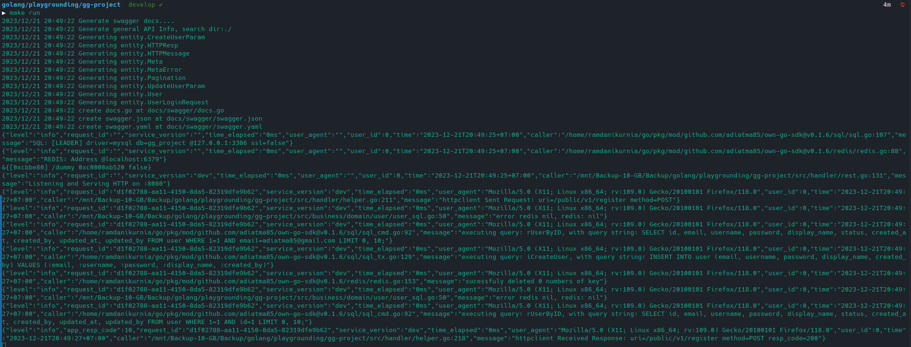

# Gantenk-Gamink Toolkit App (Tentative Name)

This Project is being developed by GG-Team

Project Structure and Explanation is below:

```
-docs
 -sql
 -swagger
 -templates
-env
-etc
 -cfg
 -tpl
-src
 -business
  - domain
  - entity
  - usecase
 -cmd
 -handler
-utils
 -config

```

1. docs
   
   This files contain ``sql`` file that store all of our migration file. Next is ``swagger`` where we can access/debug our API. For now, just ignore ``templates`` file.

2. env
   
   For the sake of simplicity, we using ``docker-compose`` to make our enviroment same when developing. You can run it with
   ```bash
   $ cd env | docker compose up -d
   ```

   or if you using ``docker-compose``
   ```bash
   $ cd env | docker-compose up -d
   ```

   In the docker compose file, there are ``redis`` and ``mysql``. If you already have ``mysql`` in your machine, just comment it, and run the ``docker compose`` command to avoid conflict with your local db.

3. etc
   
   This is where we store our config file as a ``.json`` . You can use the ``conf.template.json`` to construct your config.

4. src

    The main source code of the project. You can see the ``business`` folder contain some files. I recommend you to familliar with these files, because you will see/edit them a lot in the future.

    ``domain`` as name implies a source code to handling in the domain layer. If you not familiar with this term, imagine a ``model`` in Laravel. That is the ``domain``. Their function is to "talking" with our storage (i.e database)

    ``entity`` is where we store all the type of our object in here. People often said it as ``data transfer object`` or ``dto`` in short. Many name, but same function.

    ``usecase`` is where the main logic of our source code. Its function is pretty similliar to ``controller`` in Laravel.

    The other folder are ``cmd`` and ``handler``. As the name implies, ``cmd`` folder only have our ``main.go``. In the other hand, ``handler`` is the folder where we define all the routes and their respective handler function.

5. utils
   
   This is where we read the config file from before and insert the environment variable to our source code.


## How to run this ??

1. Make sure you have golang installed on your machine
2. Run the docker compose to run some container like Redis and MySQL DB
3. Make your config file
4. Start the app with command (Linux or MAC) / in windows, you can read reference how to have ``make`` command either using ``WSL`` or ``git bash``

   ```bash
   $ make run
   ```
5. The app is running on port ``8080`` (Default). If running, you will something like this on your terminal:



